# Loss Frame campaigns

---
## Video Script 1: “Quaker Quandaries: The Hidden Costs”
<figure style="width:500px">
    <figcaption><b>Scene 1</b>: Quick cuts between a student's PennCard being declined at a campus event due to insufficient funds from vaping expenses, and another student enjoying Penn's vibrant cultural and academic offerings, funded by smart financial choices. The contrast highlights the hidden costs of vaping and the value of wise spending at the University of Pennsylvania.</figcaption>
    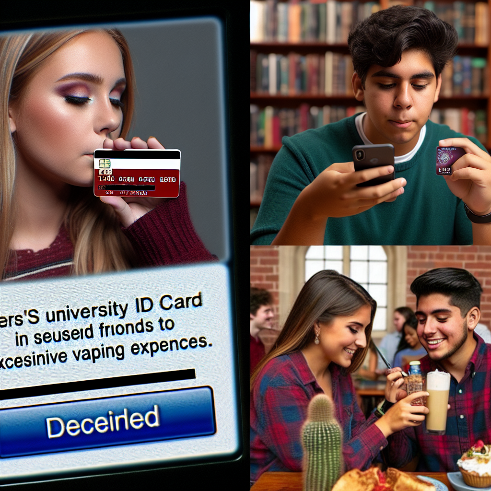
</figure>

<figure style="width:500px">
    <figcaption><b>Scene 2</b>: A visual metaphor of fog clouding the iconic Benjamin Franklin statue, paralleling a student's clouded academic focus due to vaping. This scene contrasts with clear, sunny scenes of successful Penn students, emphasizing the importance of clarity in thought and purpose, inspired by Benjamin Franklin's legacy.</figcaption>
    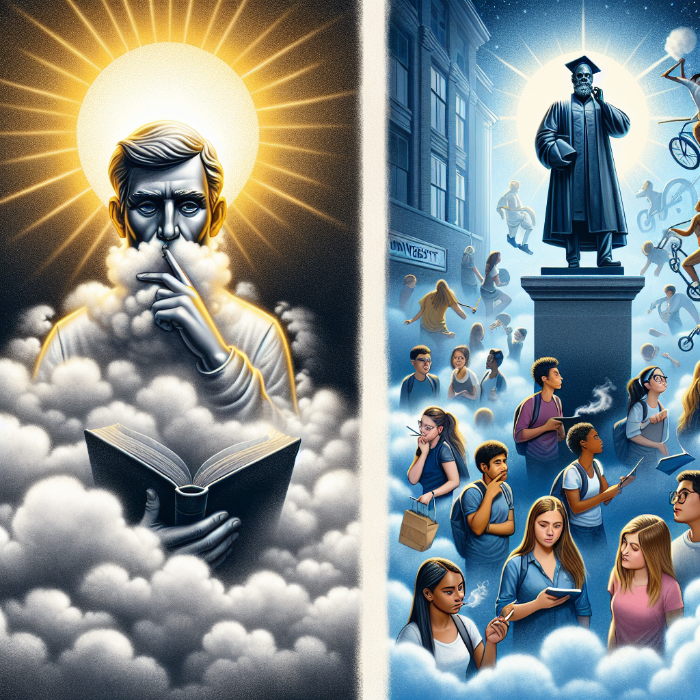
</figure>

<figure style="width:500px">
    <figcaption><b>Scene 3</b>: A student vaping alone on Locust Walk, observing vibrant, connected groups of Penn students engaged in lively discussions and laughter. The scene conveys the isolation that can come with vaping and the vibrant community available to those who choose to engage fully in the Penn experience.</figcaption>
    
</figure>

<figure style="width:500px">
    <figcaption><b>Scene 4</b>: The energy and teamwork inside Penn's historic Palestra during a no-vape game contrast starkly with the solitude of vaping outside, missing the camaraderie and excitement. This scene emphasizes the importance of participation and unity in the Penn community, highlighting the downsides of vaping.</figcaption>
    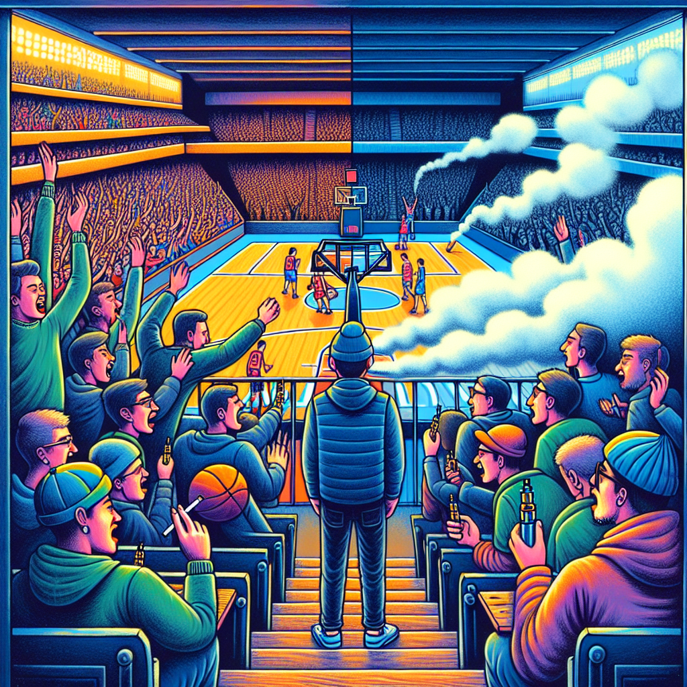
</figure>

<figure style="width:500px">
    <figcaption><b>Scene 5</b>: A student struggling with concentration in Van Pelt Library due to vaping, juxtaposed with focused students contributing to vibrant academic discussions and groundbreaking research. The scene highlights the potential of every Penn student to contribute to the legacy of intellectual leadership, hindered by the distractions of vaping.</figcaption>
    
</figure>

---
## Video Script 2: “Fog Over Franklin’s Fields”
<figure style="width:500px">
    <figcaption><b>Scene 1</b>: Illustrate a contrasting scene where one group of students in athletic gear holds vapes and looks unprepared and dispirited on one side of the screen, while on the other side, a vibrant, energetic group of students is ready for action. The setting is an outdoor sports field, setting the stage for an impending athletic challenge.</figcaption>
    
</figure>

<figure style="width:500px">
    <figcaption><b>Scene 2</b>: Capture the decisive moment of the athletic challenge, with the non-vaping group surging ahead, full of determination and stamina, while the vaping group lags behind, clearly struggling. The scene highlights the physical disadvantages of vaping in contrast to the benefits of a healthy, active lifestyle.</figcaption>
    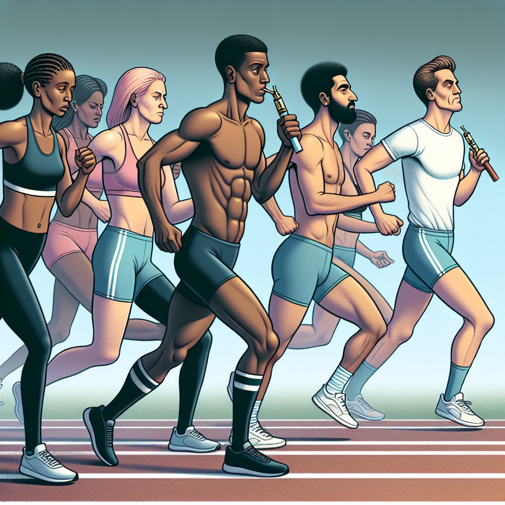
</figure>

<figure style="width:500px">
    <figcaption><b>Scene 3</b>: After the challenge, show the non-vaping group celebrating their victory with high energy, high fives, and joyous expressions. In stark contrast, the vaping group appears exhausted and dejected, emphasizing the immediate and visible consequences of their choices.</figcaption>
    
</figure>

<figure style="width:500px">
    <figcaption><b>Scene 4</b>: End with a triumphant group shot of the non-vapers, holding a trophy or wearing medals, their faces beaming with pride against the backdrop of the sports field. This scene symbolizes their broader victory over the temptations and limitations of vaping.</figcaption>
    
</figure>

---
## Video Script 3: “Disconnected on Locust Walk”
<figure style="width:500px">
    <figcaption><b>Scene 1</b>: Open with a dull, uninspired setting where teens are vaping, their expressions listless and disengaged. The atmosphere changes as one teen, dissatisfied with vaping, puts it down and picks up a guitar, igniting a spark of interest and inspiration among the others.</figcaption>
    
</figure>

<figure style="width:500px">
    <figcaption><b>Scene 2</b>: Transition to a vibrant, creative workshop brimming with art supplies, instruments, and digital art tools. Teens are immersed in painting, music, and creative projects, their faces alight with passion and inspiration, showcasing the enriching alternative to vaping.</figcaption>
    
</figure>

<figure style="width:500px">
    <figcaption><b>Scene 3</b>: Create a montage of teens proudly showcasing their creative achievements: a beautifully finished painting, a group recording a song, and a teen hitting 'publish' on a blog post. Their expressions of pride and fulfillment underscore the rewarding nature of creative pursuits over vaping.</figcaption>
    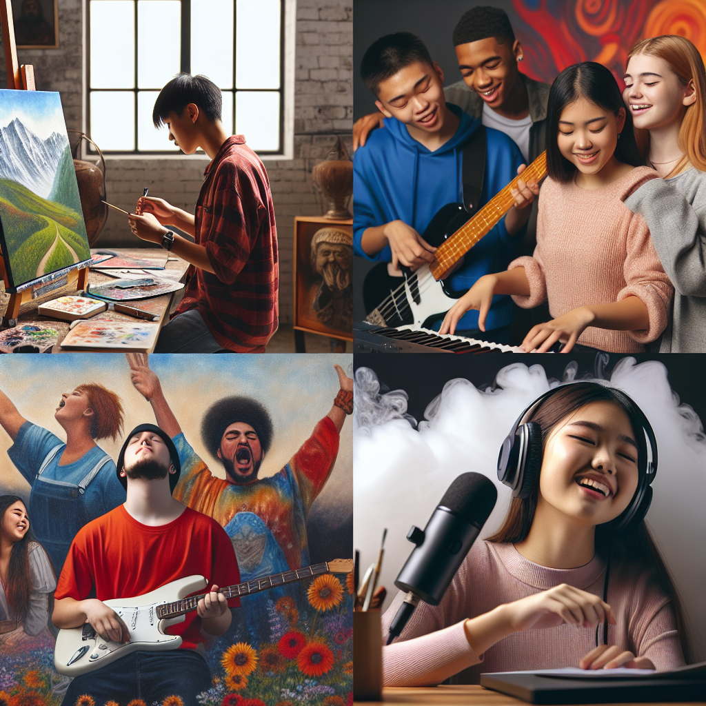
</figure>

<figure style="width:500px">
    <figcaption><b>Scene 4</b>: Conclude with a scene at an exhibition or live performance where the teens present their work to an appreciative audience. The supportive and admiring community underscores the value of sharing talents and the positive reinforcement of creative expression.</figcaption>
    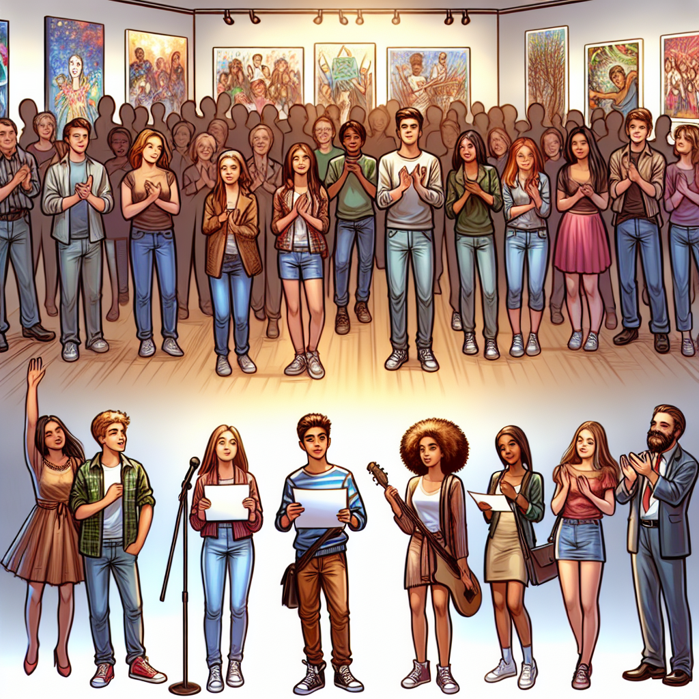
</figure>

---
## Video Script 4: “The Palestra’s Promise Dimmed”
<figure style="width:500px">
    <figcaption><b>Scene 1</b>: Depict teens in a cozy, thoughtful setting, engaged in jotting down their dreams and aspirations in journals or assembling dream boards. Surround them with symbols of their aspirations, such as books, globes, and instruments, highlighting the importance of future goals over immediate gratification from vaping.</figcaption>
    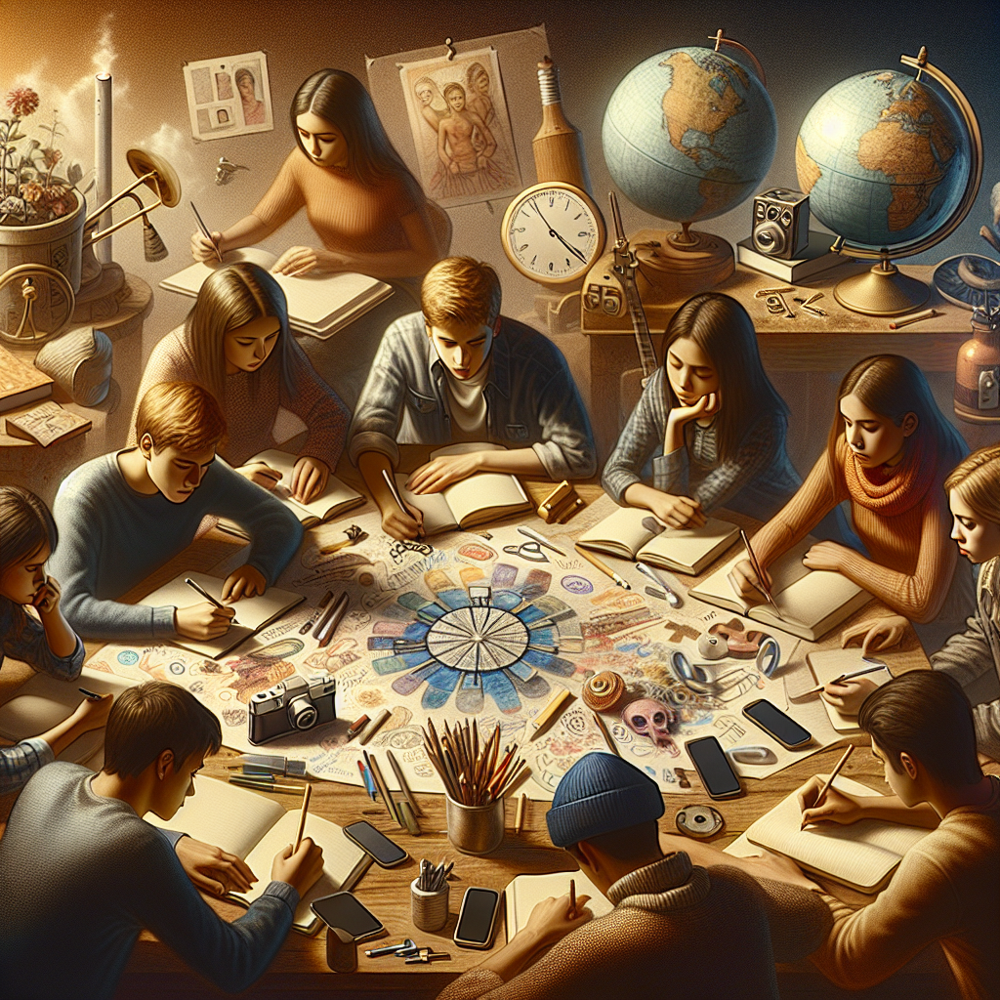
</figure>

<figure style="width:500px">
    <figcaption><b>Scene 2</b>: Show teens actively working towards their dreams: studying diligently, interning in professional environments, and honing their skills, all in the absence of vaping. The environment reflects a sense of progress, ambition, and the rewards of dedication.</figcaption>
    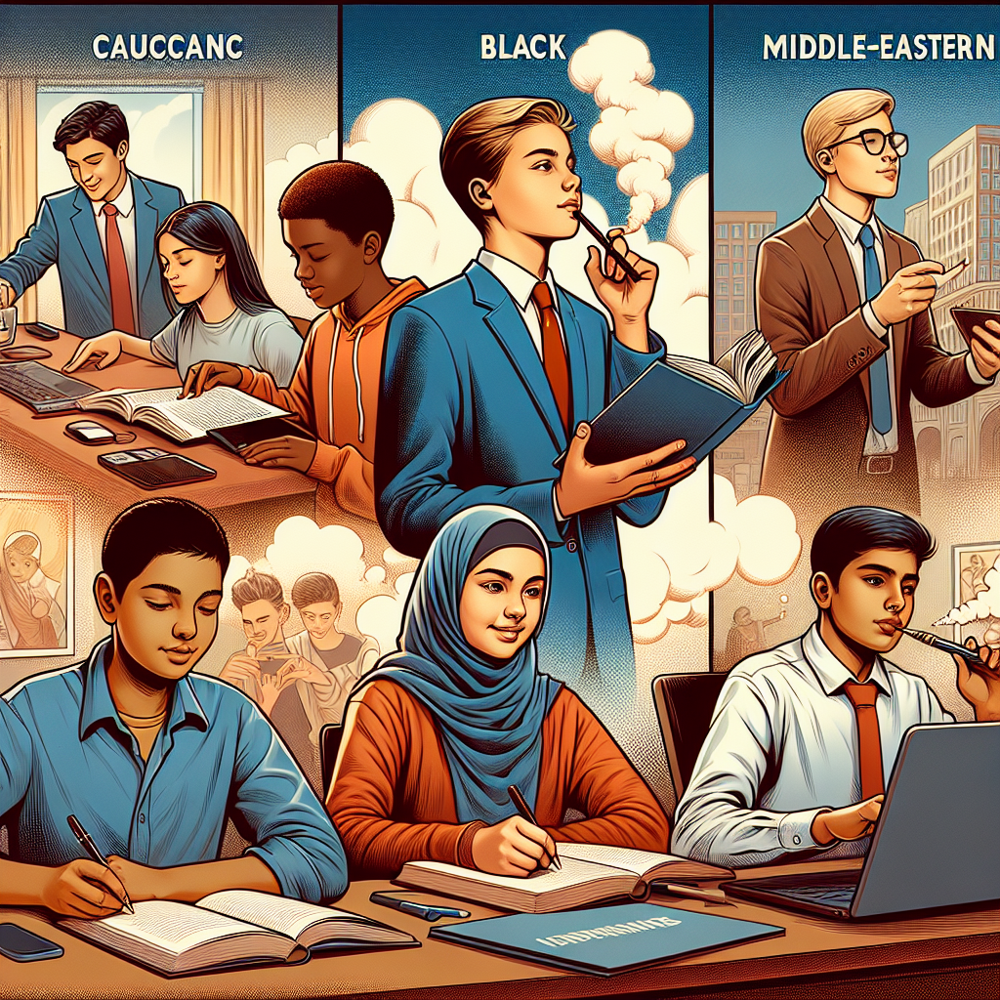
</figure>

<figure style="width:500px">
    <figcaption><b>Scene 3</b>: Highlight significant achievements: one teen receiving a college acceptance letter, another presenting an innovative project, and a third performing on stage. These pivotal moments capture the climax of their hard work, underscoring the long-term benefits of focus and persistence.</figcaption>
    
</figure>

<figure style="width:500px">
    <figcaption><b>Scene 4</b>: Visualize the teens, now slightly older, living out their dreams—graduating, traveling, or thriving in their careers. Each scene should radiate fulfillment and the realization of their ambitions, illustrating the profound, lasting rewards of dedication and wise choices.</figcaption>
    
</figure>

---
## Video Script 5: “Van Pelt’s Vanishing Voices”
<figure style="width:500px">
    <figcaption><b>Scene 1</b>: Capture a lively party scene with teens enjoying themselves, the atmosphere full of laughter and dancing. Use a split-screen effect to show one teen stepping outside to vape, missing a key moment of connection and joy inside, emphasizing the social costs of vaping.</figcaption>
    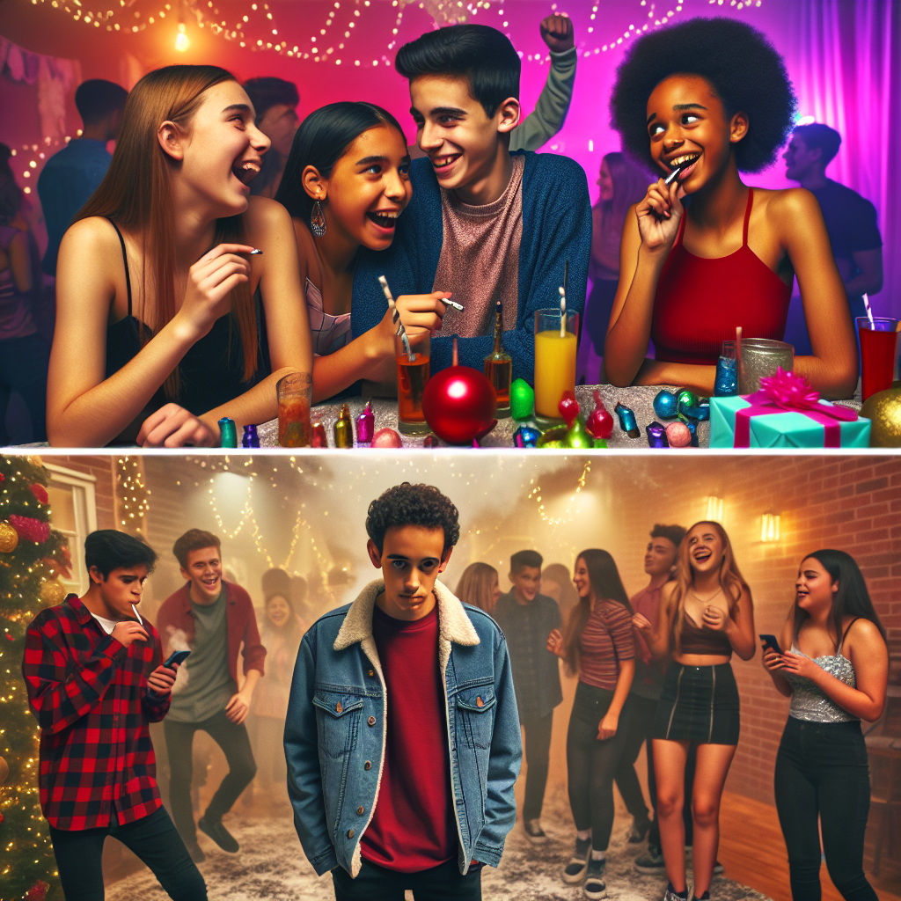
</figure>

<figure style="width:500px">
    <figcaption><b>Scene 2</b>: Illustrate the non-vaping teens engaging in a variety of fun activities together: playing games, dancing, and sharing laughs in an inclusive, vibrant setting. The warm, inviting atmosphere highlights the joys of genuine connection and shared experiences.</figcaption>
    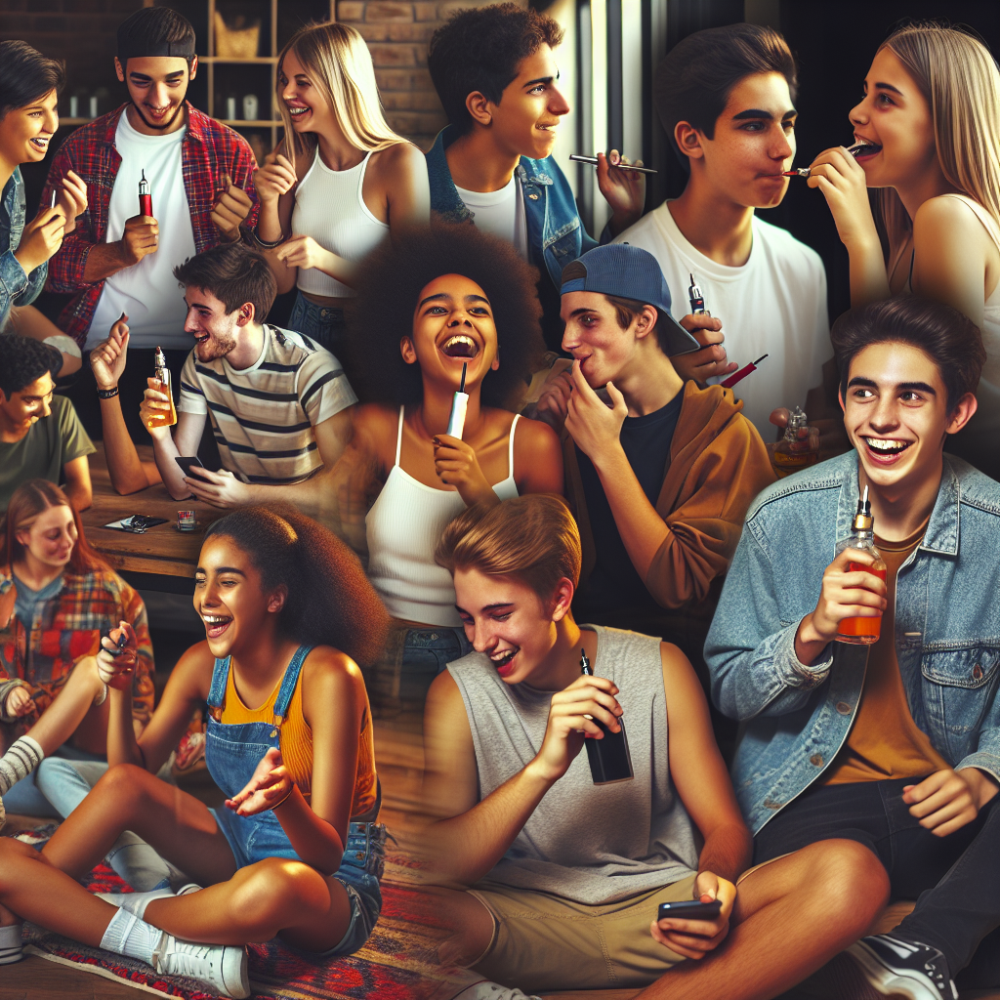
</figure>

<figure style="width:500px">
    <figcaption><b>Scene 3</b>: Depict the moment the previously vaping teen decides to ditch the vape and rejoin the group, being immediately welcomed into a group selfie. This scene symbolizes the ease of reconnection and the enduring warmth of friendships when vaping is left behind.</figcaption>
    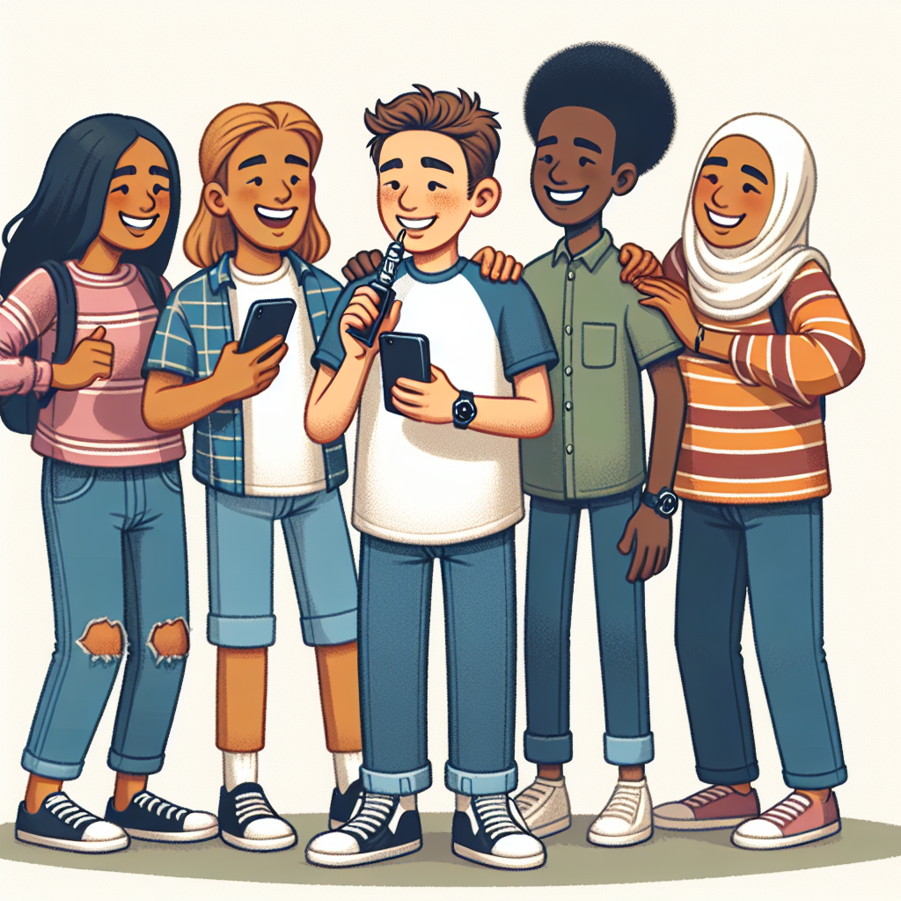
</figure>

<figure style="width:500px">
    <figcaption><b>Scene 4</b>: Conclude with a series of snapshots depicting different gatherings, all featuring happy, connected teens enjoying themselves vape-free. These snapshots convey a strong sense of community, shared laughter, and the memorable moments that come from true connection.</figcaption>
    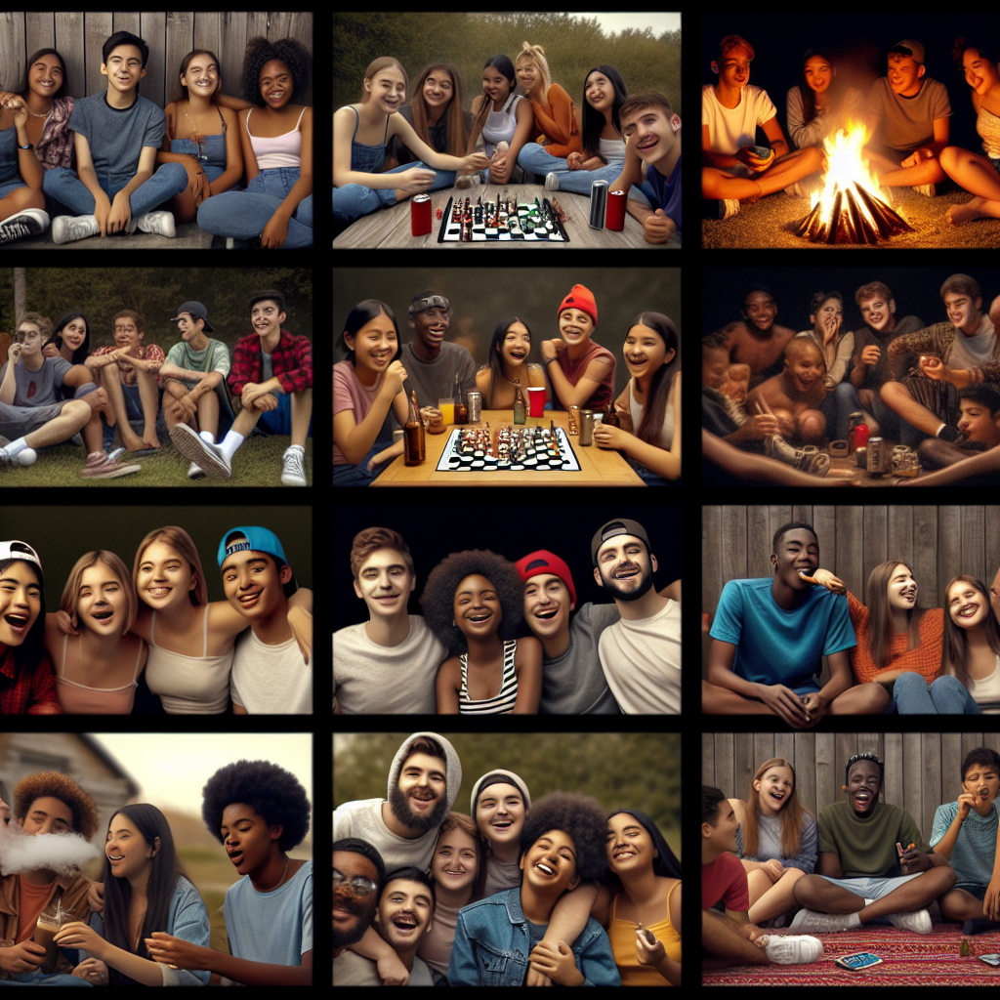
</figure>
